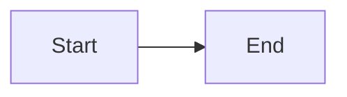

# Markdown README Manual

---

## Headings

````md
```md
# Main Title
## Section
### Subsection
```
````

Preview:

# Main Title

## Section

### Subsection

---

## Bold Text

````md
```md
**Bold text**
```
````

Preview:

**Bold text**

---

## Italic Text

````md
```md
*Italic text*
```
````

Preview:

*Italic text*

---

## Strikethrough

````md
```md
~~Removed text~~
```
````

Preview:

~~Removed text~~

---

## Blockquotes

````md
```md
> Important information
```
````

Preview:

> Important information

---

## Unordered Lists

````md
```md
- HTML
- CSS
- JavaScript
```
````

Preview:

* HTML
* CSS
* JavaScript

---

## Ordered Lists

````md
```md
1. Install
2. Configure
3. Run
```
````

Preview:

1. Install
2. Configure
3. Run

---

## Task Lists

````md
```md
- [x] Completed
- [ ] Pending
```
````

Preview:

* [x] Completed
* [ ] Pending

---

## Inline Code

````md
```md
Use `npm install`
```
````

Preview:

Use `npm install`

---

## Code Blocks

````md
```js
console.log("Hello World")
```
````

Preview:

```js
console.log("Hello World")
```

---

## Tables

````md
```md
| Language | Usage |
|-----------|-------|
| HTML | Structure |
| CSS | Styling |
| JS | Logic |
```
````

Preview:

| Language | Usage     |
| -------- | --------- |
| HTML     | Structure |
| CSS      | Styling   |
| JS       | Logic     |

---

## Links

````md
```md
[GitHub](https://github.com)
```
````

Preview:

[GitHub](https://github.com)

---

## Images

````md
```md

```
````

Preview:


---

## Horizontal Line

````md
```md
---
```
````

Preview:

---

## GitHub Badges

````md
```md

```
````

Preview:


---

## Centered Content

````md
```html
<div align="center">

# Project Name

Professional project description.

</div>
```
````

Preview:

<div align="center">

# Project Name

Professional project description.

</div>

---

## GitHub Alerts

````md
```md
> [!NOTE]
> Important information.
```
````

Preview:

> [!NOTE]
> Important information.

---

## Expandable Sections

````md
```html
<details>
<summary>Click here</summary>

Hidden content.

</details>
```
````

Preview:

<details>
<summary>Click here</summary>

Hidden content.

</details>

---

## Mermaid Diagrams

````md

````

Preview:


---

## Math Formulas

````md
```md
$$
a^2 + b^2 = c^2
$$
```
````

Preview:

$$
a^2 + b^2 = c^2
$$

---

## Keyboard Keys

````md
```html
<kbd>Ctrl</kbd> + <kbd>C</kbd>
```
````

Preview:

<kbd>Ctrl</kbd> + <kbd>C</kbd>

---

## Highlighted Text

````md
```html
<mark>Highlighted text</mark>
```
````

Preview:

<mark>Highlighted text</mark>

---

## Professional README Structure

````md
```md
# Project Name

Professional short description.

## Features

- Fast
- Responsive
- Modern

## Installation

```bash
npm install
```

## Usage

```bash
npm start
```

## Technologies

- HTML
- CSS
- JavaScript

## License

MIT
```
````

Preview:

# Project Name

Professional short description.

## Features

* Fast
* Responsive
* Modern

## Installation

```bash
npm install
```

## Usage

```bash
npm start
```

## Technologies

* HTML
* CSS
* JavaScript

## License

MIT
